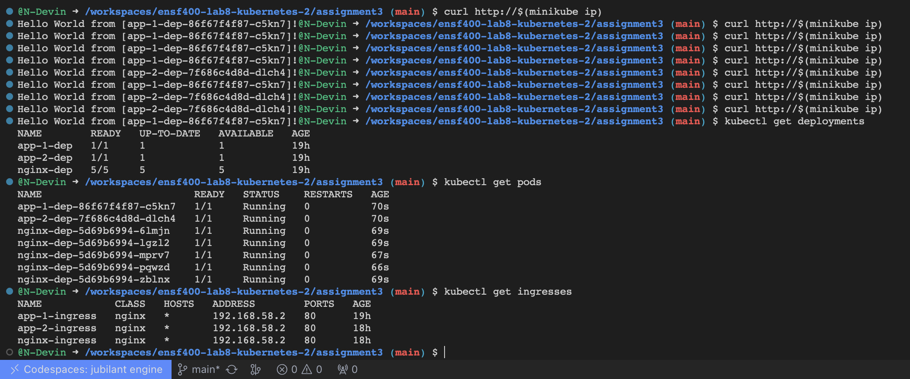

### Instructions to run

- Run the following commands :

```bash
cd assignment3
minikube start
minikube addons enable ingress
kubectl apply -f '*.yaml'
curl http://$(minikube ip)/
```

your output should then roughly resemble:



- you can fruther run the following commands for more info :

```bash
kubectl get pods
kubectl get deployments
kubectl get ingresses
```
